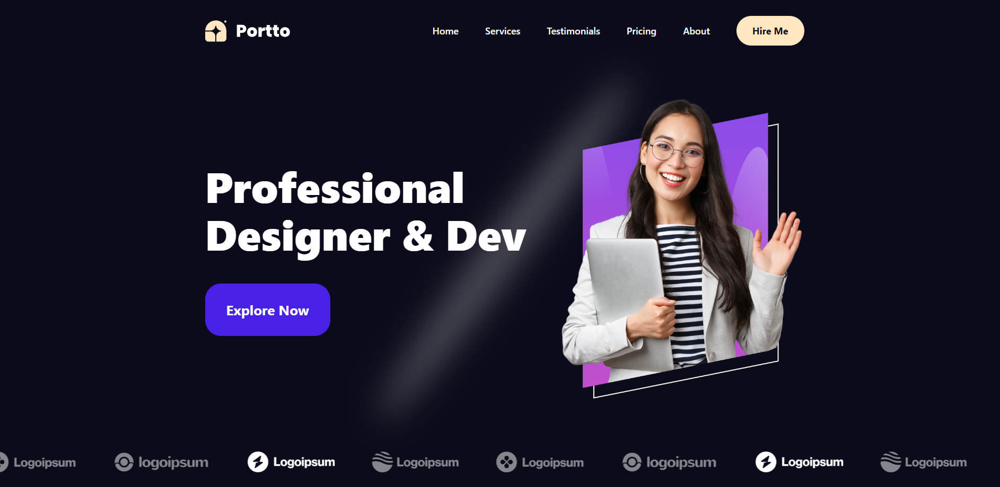
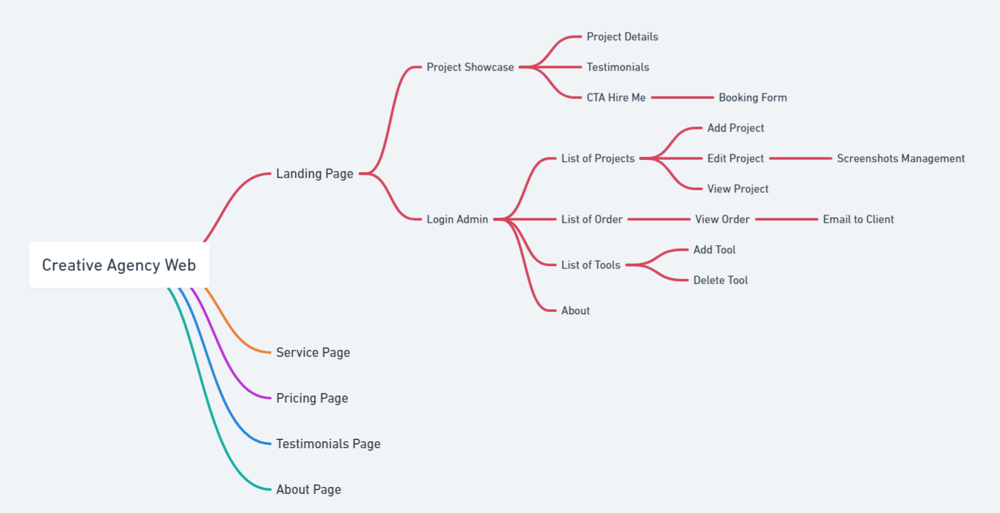
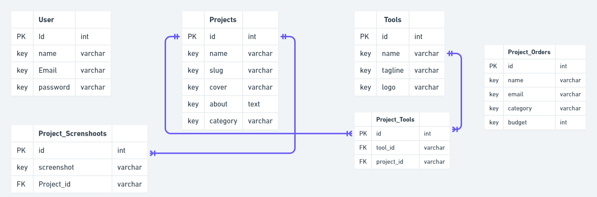

# Creative Agency with CMS

Welcome to the Creative Agency with CMS repository! This project is designed to provide a comprehensive solution for creative agencies looking to manage their digital content efficiently and effectively using Laravel.



## Features

- **Responsive Web Design**: Beautiful and adaptive web design that looks great on all devices.
- **Intuitive CMS**: A user-friendly content management system that allows easy updates and maintenance of website content.
- **Customizable Templates**: Flexible and customizable templates to match your unique brand identity.
- **SEO Optimization**: Built-in SEO tools to help your website rank higher in search engine results.
- **Secure and Scalable**: Robust security features and scalable architecture to grow with your business.

## Technologies Used

- **Frontend**: HTML, Tailwind CSS, JavaScript, Vue.js
- **Backend**: PHP, Laravel
- **Database**: MySQL
- **CMS**: Custom-built CMS integrated with Laravel
- **Deployment**: Docker, AWS

## Web Flow Overview

- **Landing Page**: Showcases projects, testimonials, and provides a "Hire Me" button for client bookings.
- **Service Page**: Details the services offered by the agency.
- **Pricing Page**: Lists pricing for different services.
- **Testimonial Page**: Displays client reviews and feedback.
- **About Page**: Provides information about the agency, its team, and its mission.
- **Admin Panel**:
  - Manage projects (Add, Edit, View)
  - View and email clients about orders
  - Manage tools (Add, Delete)
  - View information about freelancers

## Entity-Relationship Diagram (ERD) Overview

1. **User**
   - **Attributes**:
     - `id`: Unique identifier for the user.
     - `name`: Name of the user.
     - `email`: Email address of the user.
     - `password`: Password for user authentication.

2. **Projects**
   - **Attributes**:
     - `id`: Unique identifier for the project.
     - `name`: Name of the project.
     - `slug`: URL-friendly version of the project name.
     - `cover`: Cover image or thumbnail for the project.
     - `about`: Description or details about the project.
     - `category`: Category or type of the project.

3. **Tools**
   - **Attributes**:
     - `id`: Unique identifier for the tool.
     - `name`: Name of the tool.
     - `tagline`: Short description or tagline for the tool.
     - `logo`: Logo or image representing the tool.

4. **Project_Tools**
   - **Attributes**:
     - `id`: Unique identifier for the association.
     - `tool_id`: Foreign key referencing `Tools`.
     - `project_id`: Foreign key referencing `Projects`.

5. **Project_Orders**
   - **Attributes**:
     - `id`: Unique identifier for the order.
     - `name`: Name of the client or person placing the order.
     - `email`: Email address of the client.
     - `category`: Category of the project order.
     - `budget`: Budget allocated for the project order.

6. **Project_Screenshots**
   - **Attributes**:
     - `id`: Unique identifier for the screenshot.
     - `screenshot`: Path or URL to the screenshot image.
     - `project_id`: Foreign key referencing `Projects`.

### Relationships

1. **User to Projects**
   - **Type**: One-to-Many
   - **Description**: A user can create or manage multiple projects. Each project is associated with one user.

2. **Projects to Project_Tools**
   - **Type**: One-to-Many
   - **Description**: Each project can use multiple tools. The `Project_Tools` table links projects with tools.

3. **Tools to Project_Tools**
   - **Type**: One-to-Many
   - **Description**: Each tool can be used in multiple projects. The `Project_Tools` table links tools with projects.

4. **Projects to Project_Screenshots**
   - **Type**: One-to-Many
   - **Description**: Each project can have multiple screenshots. The `Project_Screenshots` table links screenshots with projects.

5. **Projects to Project_Orders**
   - **Type**: One-to-Many
   - **Description**: Each project can have multiple orders. The `Project_Orders` table links orders with projects.


## Getting Started

1. **Clone the repository**:
    ```sh
    git clone https://github.com/rachmaadr/creatife-agency-with-cms.git
    ```
2. **Navigate to the project directory**:
    ```sh
    cd creatife-agency-with-cms
    ```
3. **Install dependencies**:
    ```sh
    composer install
    npm install
    ```
4. **Set up environment variables**:
    ```sh
    cp .env.example .env
    php artisan key:generate
    ```
5. **Run the development server**:
    ```sh
    php artisan serve
    npm run dev
    ```

## Contributing

I welcome contributions from the community! Please feel free to submit issues, fork the repository, and send pull requests.
